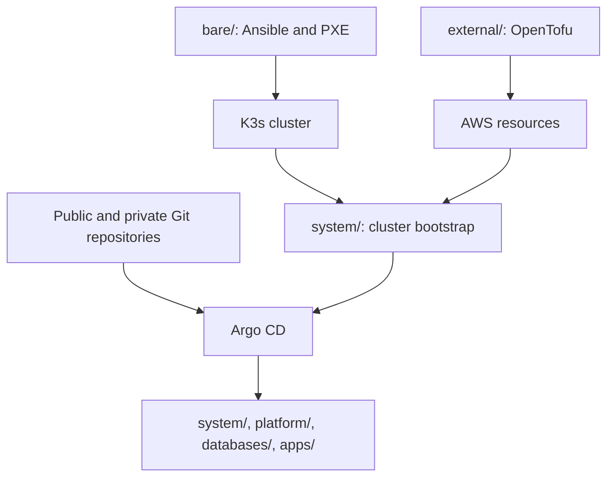

# Homelab infrastructure

Infrastructure-as-code for a bare-metal Kubernetes homelab. This repository provisions the machines and cluster foundation, manages AWS-backed external resources, and declares workloads for Argo CD to reconcile.

## Repository map

- `bare/` — Ansible playbooks and roles for PXE-based machine bootstrapping and K3s cluster installation.
- `external/` — OpenTofu configuration and reusable AWS modules (ECR, IAM/OIDC, Route 53, S3, Parameter Store, Secrets Manager).
- `system/` — cluster bootstrap playbook, Helm releases for Argo CD, External Secrets, cert-manager, Longhorn and monitoring, and the CoreDNS custom-forwarding manifest.
- `platform/` — shared platform services: CloudNativePG, EMQX and Grafana.
- `databases/` — CloudNativePG clusters and pgAdmin.
- `apps/` — application Helm releases and the OPNsense backup Kubernetes manifests.

Start with the [documentation index](docs/index.md) for the [architecture overview](docs/architecture.md), [service and dependency catalog](docs/service-catalog.md), [provisioning reference](docs/provisioning-reference.md), [operations guide](docs/operations.md), and [open questions](docs/open-questions.md). These describe checked-in configuration, not live deployment state.

Focused references describe declarations and their runtime verification boundaries:

- [Networking](docs/networking.md): K3s networking defaults, ingress/TLS, DNS credential boundaries, MQTT transport, and PXE exposure.
- [Storage](docs/storage.md): Longhorn volume jobs, PostgreSQL backup and recovery inputs, and S3 protection and retention limits.
- [Security](docs/security.md): GitOps and credential trust boundaries, declared access controls, and potential risks requiring operator verification.
- [Recovery first response](docs/runbooks/recovery.md): safe read-only triage and explicit approval gates; not a restore procedure.
- [OS lifecycle and maintenance](docs/maintenance/os-lifecycle.md): opt-in Linux lifecycle playbooks, audited osquery collection and deterministic drift report; no live validation is implied.

## Architecture at a glance

The diagram reflects repository-declared provisioning and reconciliation relationships; it does not confirm that the resources are currently deployed or healthy.

## Deployment overview

The top-level `make` target runs `bare` and then `system`; `external` is intentionally separate because Terraform/OpenTofu operations are resource-creating and need configured state and credentials. Typical lifecycle:

1. Configure Ansible inventory and SSH access in `bare/`.
2. Provision AWS resources separately from `external/` using the example backend and variable files as templates.
3. Run the bare-metal boot and K3s playbooks.
4. Provide the Kubernetes config and bootstrap External Secrets/Argo CD with `system/`.
5. Argo CD discovers public charts/manifests under `apps/*`, `system/*`, `platform/*`, and `databases/*`; private applications come from the separately configured private repository.

Do not run provisioning against a live environment without reviewing plans and confirming the target cluster/account. See the operations guide for exact command behavior and required inputs.

## Secrets and configuration

Credentials are expected from AWS Secrets Manager, External Secrets, and environment variables at bootstrap; do not commit populated `.tfvars`, backend configuration, kubeconfigs, credentials, or rendered secret manifests. The IAM user module does not create access keys, and the Secrets Manager module creates secret containers without values. Operators must supply required AWS secret/parameter values and the bootstrap environment separately; the tracked `*.example` files are templates only. Review the [operations prerequisites](docs/operations.md#prerequisites) before bootstrap.

## Validation

This repository has no checked-in automated test suite or CI workflow. Validate changes with the relevant Ansible syntax checks, OpenTofu formatting/validation, and Helm template rendering described in [operations](docs/operations.md). Those commands require their respective tools and dependencies.
