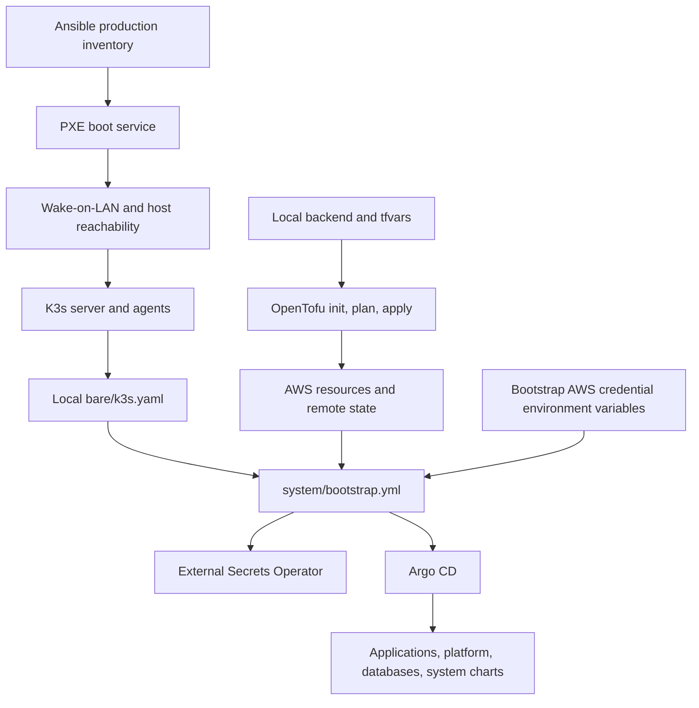

# Provisioning reference: bare metal, K3s, and AWS

## Scope and evidence

This reference extends the service catalog with the provisioning mechanics found in repository baseline `4446c988b612d1c56e0703df6124d45191adf44a`. It documents checked-in playbooks, module calls, Makefiles, and variables; it does not verify the live K3s cluster, AWS resources, remote state, or credentials. Secret values, host addresses, MAC addresses, and per-environment values are deliberately omitted. See the [hardware inventory](hardware-inventory.md) for bare-metal specifications.

For the component map and application/database relationships, see [architecture](architecture.md) and the [service catalog](service-catalog.md). Commands that mutate infrastructure are also described in the [operations guide](operations.md).

## Provisioning sequence

The OpenTofu lane is a separate root Make target; it is not invoked by the default root target. The graph describes required configuration relationships, not verified completion or runtime health.

## Bare-metal and K3s provisioning

### Inventory and play ordering

[`bare/inventories/prod.yml`](../bare/inventories/prod.yml) groups three declared machines as one `masters` host and two `workers`, and sets a shared control-plane endpoint. The concrete addresses and MAC values remain in the inventory and are not duplicated here.

[`bare/boot.yml`](../bare/boot.yml) has two plays:

1. Run the `pxe_server` role on localhost. The role prepares boot files and generated GRUB, dnsmasq, and cloud-init configuration, then starts its Docker Compose service.
2. Run the `wake` role on the bare-metal group. It sends Wake-on-LAN packets and waits for Ansible connectivity (up to 1800 seconds).

[`bare/cluster.yml`](../bare/cluster.yml) first applies the `k3s` role to the bare-metal group, then applies `dependencies` to the `masters` group. The dependency role installs Helm `v3.17.1` on the master group.

### PXE network and ISO behavior

[`bare/roles/pxe_server/files/docker-compose.yml`](../bare/roles/pxe_server/files/docker-compose.yml) runs dnsmasq with `network_mode: host` and the `NET_ADMIN` capability. It mounts boot files into `/tftp`; the HTTP container separately publishes host port `8080` for ISO/cloud-init downloads. The controller needs Docker Engine, Compose v2, and `xorriso`, which the [PXE tasks](../bare/roles/pxe_server/tasks/main.yml) call to extract the downloaded ISO.

The [dnsmasq template](../bare/roles/pxe_server/templates/dnsmasq.conf.j2) disables DNS serving (`port=0`), enables DHCP logging, defines a DHCP address pool with a 12-hour lease and router option, and serves TFTP from `/tftp`. It matches client architecture options `7` and `9` to serve `grubx64.efi` for UEFI boot. This is a lease-serving DHCP configuration, **not proxy-DHCP**; starting it on a network with another DHCP server may cause conflicting offers. Review the concrete pool/router settings in source and isolate the provisioning network as appropriate.

[`bare/group_vars/all.yml`](../bare/group_vars/all.yml) defines both `iso_uri` and `iso_checksum`, but the download task comments out `checksum: "{{ iso_checksum }}"`. Checksum verification is therefore disabled in that task despite the configured variable. The [GRUB template](../bare/roles/pxe_server/templates/grub.cfg.j2) also hard-codes the ISO basename in its HTTP URL; changing `iso_uri` alone does not update that boot URL.

### K3s role behavior

[`bare/roles/k3s/tasks/main.yml`](../bare/roles/k3s/tasks/main.yml) downloads the K3s installer, installs a server on `masters`, reads the server node token for use when installing worker agents, and configures workers with the shared control-plane endpoint. It then reads the server kubeconfig, replaces its loopback API endpoint with the configured endpoint, and writes `bare/k3s.yaml` on the Ansible controller with mode `0600`. The root `.gitignore` excludes `k3s.yaml`.

The official [K3s quick-start](https://docs.k3s.io/quick-start) documents the server/agent model and the node-token/kubeconfig files referenced by the role; [K3s configuration](https://docs.k3s.io/installation/configuration) documents the installer settings used by server and agent nodes.

### Ansible entry points

- `make -C bare boot` executes `boot.yml` with `inventories/prod.yml`.
- `make -C bare cluster` executes `cluster.yml` with the same inventory.
- `make -C bare` runs `boot` and then `cluster`.
- `system/Makefile` sets `KUBECONFIG` to `bare/k3s.yaml`; `make -C system bootstrap` runs `system/bootstrap.yml`.

The checked-in tasks reference the `community.docker`, `community.general`, and `kubernetes.core` collections in addition to Ansible built-ins. The [Ansible inventory guide](https://docs.ansible.com/ansible/latest/inventory_guide/intro_inventory.html) is the upstream reference for the inventory and group targeting used by these plays.

## Cluster bootstrap hand-off

`system/bootstrap.yml` runs locally against the `KUBECONFIG` supplied by `system/Makefile`. It creates the `argocd` and `external-secrets` namespaces, validates the two `HOMELAB_ESO_*` environment variables, and creates the `awssm-secret` Kubernetes Secret directly from them. It then renders/applies External Secrets resources before rendering/applying Argo CD. No live cluster operation was run for this documentation update.

After bootstrap, Argo CD ApplicationSets reconcile the repository paths described in [architecture](architecture.md). A successfully applied bootstrap play is not itself evidence that all generated applications are healthy; consult the configured Argo CD instance for live state.

## OpenTofu root configuration

### Inputs and backend

[`external/main.tf`](../external/main.tf) requires the HashiCorp AWS provider with a `~> 5.0` version constraint and uses an S3 backend with `bucket`, `key`, `region`, and `dynamodb_table` settings. Those root backend values are empty placeholders in the tracked file. [`external/config/backend/prod.tfbackend.example`](../external/config/backend/prod.tfbackend.example) and [`external/config/environment/prod.tfvars.example`](../external/config/environment/prod.tfvars.example) are templates; the Makefile expects populated local files without the `.example` suffix.

The declared root variables are `aws_account_number`, `region`, `project_name`, `environment`, `hosted_zone_domain_name`, `github_oidc_audiences`, and `github_oidc_repositories`. The AWS provider region is taken from `var.region`; default tags come from the root `default_label` module. The S3 backend and its required fields are covered in the [OpenTofu S3 backend reference](https://opentofu.org/docs/language/settings/backends/s3/).

### Root module-call map

| Root file | Module callers in source | Local module source / role |
|---|---|---|
| `external/ecr.tf` | `ecr_token_helper`, `ecr_opnsense_backup_tool`, `ecr_cloudlog` | `modules/ecr/public/v1`; creates public ECR repositories. The separate `modules/ecr/private/v1` module exists, but is not called by this root file. |
| `external/iam.tf` | `opnsense_backups_service_account`, `service_account`, `oidc_github` | `modules/iam/user/v1` for IAM users/policy attachments and `modules/iam/identity-provider/v1` for the GitHub OIDC provider, role, policy, and trust conditions. |
| `external/parameters.tf` | `speedtest_app_parameters` | `modules/parameter-store/v1`; creates SSM parameters. |
| `external/r53.tf` | `primary_hosted_zone` | `modules/route53/v1`; creates a Route 53 hosted zone. |
| `external/s3.tf` | `database_backups`, `volume_backups`, `opnsense_backups`, `frigate_syncs` | `modules/s3/v1`; provisions S3 buckets with module resources for encryption, versioning, public-access blocking, and optional access logging. |
| `external/sm.tf` | `speedtest_app_secrets`, `cert_manager_app_secrets`, `grafana_app_secrets`, `pihole_app_secrets`, `mikrotik_app_secrets`, `general_credentials_secrets`, `global_config_secrets`, `homelab_private_repo_secrets`, `opnsense_backups_app_secrets` | `modules/secrets-manager/v1`; declares 9 AWS Secrets Manager secret containers, without secret values. The general secret holds prefixed LiteLLM app/database properties and Linkding app properties; Linkding database credentials remain separate. |
| `external/global_local_vars.tf` | `default_label` | `cloudposse/label/null` `0.25.0`; common name/environment labels and tags. |

Only active calls are listed above. In [`external/sm.tf`](../external/sm.tf), `speedtest_db_secrets` and `argocd_app_secrets` are commented out, so they do not create resources through this root configuration. Their corresponding PushSecret destinations are still declared in Kubernetes source; that is separate from an active OpenTofu module call.

The reusable modules are under `external/modules/`. In the inspected module source, ECR private/public modules create their corresponding repository resource; IAM modules create a user or an OIDC provider/role/policy attachment; the Route 53 module creates a hosted zone; the S3 module adds encryption/versioning/public-access-block resources; Parameter Store creates an SSM parameter; and the Secrets Manager module creates a secret resource. These are code declarations, not a report of AWS resources currently present.

The GitHub OIDC identity-provider module's trust document includes audience equality and an allowed-repository subject condition. The repository supplies the audiences and allowed repository patterns through variables; the actual configured values are in local `prod.tfvars` and are not reproduced here.

### Operator-supplied AWS values and bootstrap environment

- [`external/modules/iam/user/v1/main.tf`](../external/modules/iam/user/v1/main.tf) declares an IAM user, policy, and attachment only. It has no access-key resource; its outputs are identifiers, not credentials. Operators must arrange any required access keys separately under their credential-management process.
- [`external/modules/secrets-manager/v1/main.tf`](../external/modules/secrets-manager/v1/main.tf) declares `aws_secretsmanager_secret` containers only, with no secret-version resource or payload. Operators must populate the values required by ExternalSecret consumers separately. PushSecrets for generated database/Argo CD credentials are a separate, declared writer flow, not proof that remote values exist.
- [`external/parameters.tf`](../external/parameters.tf) calls the SSM module without a value override. Its [variable default](../external/modules/parameter-store/v1/variables.tf) is a placeholder, and the [resource lifecycle](../external/modules/parameter-store/v1/main.tf) uses `ignore_changes = [value]`. Operators must populate the required parameter value separately; provisioning does not provide an application credential.
- The AWS provider/backend credential chain and the `HOMELAB_ESO_ACCESS_KEY` / `HOMELAB_ESO_SECRET_ACCESS_KEY` bootstrap environment are separate inputs. OpenTofu does not export the latter or populate them from these modules. Supply them from a trusted secret source before cluster bootstrap, without committing, logging, or documenting their values.

Consult the [service catalog](service-catalog.md#secret-provider-reference-flow) for source-level consumer mappings; it lists identifiers only, not credential values.

## OpenTofu operator workflow

[`external/Makefile`](../external/Makefile) runs these commands in order:

1. `tofu init --backend-config=config/backend/prod.tfbackend`
2. `tofu plan -var-file=config/environment/prod.tfvars -out=tfplan`
3. `tofu apply tfplan`

The final step applies the saved plan to AWS. This reference does not run it. The official [OpenTofu init guide](https://opentofu.org/docs/cli/commands/init/), [plan command](https://opentofu.org/docs/cli/commands/plan/), and [apply command](https://opentofu.org/docs/cli/commands/apply/) explain these workflow boundaries. Store backend credentials through the operator's configured AWS credential chain; do not commit populated backend files, state, or plan artifacts.

## Make target boundaries

| Command | Declared action |
|---|---|
| Root `make` | `bare` followed by `system`; does not invoke `external`. |
| `make -C bare` | PXE/host boot followed by K3s and master dependencies. |
| `make -C system bootstrap` | Cluster bootstrap via Ansible, using `bare/k3s.yaml`. |
| `make -C external` | OpenTofu init, saved plan, and apply against AWS. |

The detailed operator checklist and non-deploying validation commands remain in [`operations.md`](operations.md). The Terraform/OpenTofu and Ansible sections above describe the repository's declared workflow only; they do not certify configuration validity or current production state.
