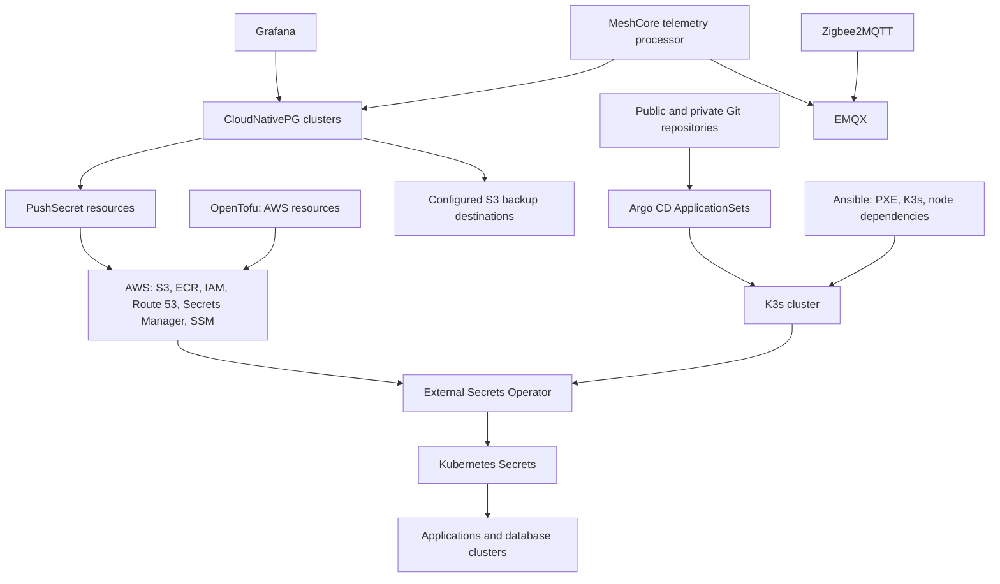

# Service and dependency catalog

## Review baseline and evidence

Repository snapshot reviewed: `004d097fe82384043520a1e43d1f085f59f0b852`. This catalog is derived from checked-in configuration, principally the referenced `Chart.yaml`, `values.yaml`, templates, Kubernetes manifests, and `databases/*/cluster.yaml` files. It does not assert that any resource is currently installed, healthy, reachable, or successfully backing up. No Kubernetes API, AWS account, or private repository was queried.

## Reconciliation map

The public ApplicationSet in [`system/argocd/values.yaml`](../system/argocd/values.yaml) scans `apps/*`, `system/*`, `platform/*`, and `databases/*` on `main`. The generated application name and default destination namespace are the directory basename. This default does not override an explicit manifest `metadata.namespace`: the `databases/*-db` manifests target their application namespaces (for example, `linkding` rather than `linkding-db`), and CoreDNS targets `kube-system` rather than `coredns`. The private ApplicationSet scans `apps/*` in the separately configured `homelab-private` repository. Automated sync, prune, self-heal, retry, namespace creation, and server-side apply are configured there.

Directories with a `Chart.yaml` are Helm chart sources. `apps/opnsense-backup/` instead contains a `kustomization.yaml` and raw Kubernetes manifests; its resource list is in [`apps/opnsense-backup/kustomization.yaml`](../apps/opnsense-backup/kustomization.yaml).

Arrows show relationships expressed in repository configuration, not observed network traffic or successful reconciliation. The CloudNativePG-to-S3 and PushSecret links are declarations; backup and secret synchronization status remains unverified.

## Application catalog

| Directory / declared workload namespace | Declared function and configured dependencies | Network, persistence, and source |
|---|---|---|
| [`apps/esphome`](../apps/esphome/) / `esphome` | ESPHome dashboard. | HTTP service port `6052`; Traefik ingress with cert-manager TLS; Longhorn PVC `10Gi`. `app-template` chart. |
| [`apps/home-assistant`](../apps/home-assistant/) / `home-assistant` | Home Assistant chart with an init container that installs HACS. A separate `home-assistant-db` cluster is declared, but this app chart does not show a database connection setting. | Ingress/TLS; Longhorn PVC `10Gi` at `/config`; upstream chart dependency `home-assistant` `0.3.51`. |
| [`apps/homepage`](../apps/homepage/) / `homepage` | Homepage dashboard. Configured widgets/links include Speedtest, Pi-hole, MikroTik, Grafana, Argo CD, pgAdmin, Linkding, LiteLLM, Longhorn, and cluster metrics. Its widget credentials are read from `homepage-app-config`. | Root internal ingress/TLS; upstream `homepage` chart `2.0.1`; Kubernetes service account/RBAC enabled. |
| [`apps/linkding`](../apps/linkding/) / `linkding` | Linkding reads its application username/password from `linkding-app-config` and connects to `linkding-db-rw.linkding` using `linkding-db-config`. | HTTP port `9090`; ingress/TLS; DB and application secrets are represented by ExternalSecrets. |
| [`apps/litellm`](../apps/litellm/) / `litellm` | LiteLLM reads `DATABASE_URL`, master key, and salt key from `litellm-app-config`; mounts `litellm-config` as `/app/config.yaml`. A `litellm-db` cluster and PushSecret use the same configured AWS credential path as the LiteLLM ExternalSecret. | HTTP port `4000`; ingress/TLS; upstream DB URL is secret-backed rather than hard-coded in the chart values. |
| [`apps/memos`](../apps/memos/) / `memos` | Memos with file-backed application configuration/data. | HTTP port `5230`; ingress/TLS; Longhorn PVC `5Gi` mounted at `/var/opt/memos`. |
| [`apps/meshcore-telemetry`](../apps/meshcore-telemetry/) / `meshcore-telemetry` | Single configured processor replica subscribes to MQTT topic `meshcore/telemetry/+` at the configured EMQX host and reads its database URL from `meshcore-telemetry-db-config`. | No Kubernetes Service is enabled in the chart; database cluster is `meshcore-telemetry-db`. MQTT TLS is configured as `false`. |
| [`apps/opnsense-backup`](../apps/opnsense-backup/) / `opnsense-backup` | Kubernetes CronJob `opnsense-backup-cronjob` uses an ExternalSecret-backed environment and a repository-hosted ECR image. A second CronJob, `ecr-creds-refresh`, uses a separate service account and namespaced RBAC. | Backup schedule is `0 0 * * *`; ECR token helper schedule is `0 */11 * * *`. This directory is raw Kustomize/Kubernetes source, not a Helm chart. |
| [`apps/speedtest`](../apps/speedtest/) / `speedtest` | Speedtest Tracker is configured with application schedule `0 * * * *` and connects to `speedtest-db-rw.speedtest`; app and database environment values are secret-backed. | HTTP port `80`; ingress/TLS. |
| [`apps/zigbee2mqtt`](../apps/zigbee2mqtt/) / `zigbee2mqtt` | Zigbee2MQTT points at the configured EMQX MQTT URL and a TCP-attached serial coordinator using adapter `zstack`. | Longhorn PVC `1Gi`; upstream chart dependency `zigbee2mqtt` `2.12.1`. |
| [`databases/pgadmin`](../databases/pgadmin/) / `pgadmin` | pgAdmin database UI; persistent data uses existing claim `pgadmin-data-recovery-1`. | HTTP port `80`; ingress/TLS; uses `app-template`. Runtime settings and the literal initial login configuration are in [`values.yaml`](../databases/pgadmin/values.yaml), not `Chart.yaml`; credential values are not repeated here. |

The application connection claims above are limited to explicit values/manifests. In particular, the existence of a database Cluster in the same namespace does not itself prove that an application uses it.

## PostgreSQL cluster and backup declarations

The five database manifests also define namespace-local `awssm-secret` ExternalSecrets that read AWS access-key properties from `homelab/prod/global/config` through `secretstore-sample`; their backup configuration refers to these Secrets. The `PushSecret` paths below are the configured destinations for generated database application credentials.

| Namespace / cluster | Instances | Declared data size | S3 destination in manifest | Retention | `ScheduledBackup` expression | Configured PushSecret path |
|---|---:|---:|---|---|---|---|
| `home-assistant` / [`home-assistant-db`](../databases/home-assistant-db/cluster.yaml) | 3 | `10Gi`, storage class explicitly `longhorn` | `s3://homelab-prod-database-backups/home-assistant` | `21d` | `0 0 */6 * * *` | `homelab/prod/databases/home-assistant/credentials` |
| `linkding` / [`linkding-db`](../databases/linkding-db/cluster.yaml) | 1 | `1Gi`; no storage class field in this cluster manifest | `s3://homelab-prod-database-backups/linkding` | `21d` | `0 0 */6 * * *` | `homelab/prod/databases/linkding/credentials` |
| `litellm` / [`litellm-db`](../databases/litellm-db/cluster.yaml) | 1 | `1Gi`; no storage class field in this cluster manifest | `s3://homelab-prod-database-backups/litellm` | `21d` | `0 0 */6 * * *` | `homelab/prod/litellm/credentials` |
| `meshcore-telemetry` / [`meshcore-telemetry-db`](../databases/meshcore-telemetry-db/cluster.yaml) | 3 | `1Gi`; no storage class field in this cluster manifest | `s3://homelab-prod-database-backups/meshcore-telemetry` | `21d` | `0 0 */6 * * *` | `homelab/prod/databases/meshcore-telemetry/credentials` |
| `speedtest` / [`speedtest-db`](../databases/speedtest-db/cluster.yaml) | 3 | `1Gi`; no storage class field in this cluster manifest | `s3://homelab-prod-database-backups/speedtest` | `21d` | `0 0 */6 * * *` | `homelab/prod/databases/speedtest/credentials` |

CloudNativePG's `ScheduledBackup.schedule` is a six-field cron expression with a seconds field, not the five-field Unix crontab format; see the versioned [CloudNativePG 1.25 backup reference](https://cloudnative-pg.io/docs/1.25/backup/). The literal expression is retained above to avoid confusing it with Kubernetes CronJob schedules. A configured destination, schedule, and retention value do not establish that backups have run or can be restored.

### Bootstrap recovery versus recurring backups

| Cluster source | `bootstrap.recovery.source` and external source server name | Recurring backup server name / `ScheduledBackup` name |
|---|---|---|
| [Linkding](../databases/linkding-db/cluster.yaml) | `linkding-db-backup-v2` | `linkding-db-backup-v3` |
| [Speedtest](../databases/speedtest-db/cluster.yaml) | `speedtest-db-backup-v5` | `speedtest-db-backup-v6` |

These clusters bootstrap by recovering from the previous server name in `externalClusters`, using the same configured S3 destination but a different `serverName` from the recurring backup output. Recovery is an initialization input, not a recurring restore operation or evidence of a successful restore. Their `ScheduledBackup` resources have `immediate: true` and the schedule/retention shown above; those declarations concern new backups of the current cluster, not the existence or retention of the historical recovery source. Home Assistant, LiteLLM, and MeshCore Telemetry instead declare `bootstrap.initdb`.

[`platform/grafana/values.yaml`](../platform/grafana/values.yaml) declares PostgreSQL data sources for `home-assistant-db-rw.home-assistant.svc.cluster.local:5432` and `meshcore-telemetry-db-rw.meshcore-telemetry.svc.cluster.local:5432`. The datasource authentication values are read from `postgres-datasources-config`.

## Secret-provider reference flow

`system/external-secrets/values.yaml` declares the `secretstore-sample` `ClusterSecretStore` backed by AWS Secrets Manager in `eu-central-1`. `system/bootstrap.yml` creates the initial `awssm-secret` in the `external-secrets` namespace from `HOMELAB_ESO_ACCESS_KEY` and `HOMELAB_ESO_SECRET_ACCESS_KEY` before installing the operator. Namespace-local ExternalSecrets refer to the ClusterSecretStore and materialize application/database secrets; namespace eligibility is declared in the store's conditions.

| Consumer | Kubernetes Secret(s) declared | AWS Secrets Manager path(s) referenced in source |
|---|---|---|
| Argo CD | `homelab-private`; `argocd-initial-admin-secret` is selected by `argocd-secrets-push` | `homelab/prod/git/private/credentials`; `homelab/prod/applications/argocd/credentials` (PushSecret destination) |
| cert-manager | `cluster-issuer-r53-credentials` | `homelab/prod/applications/certmanager/credentials` |
| External Secrets bootstrap | `awssm-secret` in `external-secrets`, seeded from the two bootstrap environment variables | No AWS remote path at bootstrap |
| Homepage | `homepage-app-config` | `homelab/prod/applications/pihole/credentials`; `homelab/prod/applications/mikrotik/credentials` |
| Linkding | `linkding-app-config`, `linkding-db-config` | `homelab/prod/applications/linkding/credentials`; `homelab/prod/databases/linkding/credentials` |
| LiteLLM | `litellm-app-config` | `homelab/prod/litellm/credentials` |
| Longhorn | `longhorn-backup-credentials` | `homelab/prod/global/config` |
| MeshCore Telemetry | `meshcore-telemetry-db-config` | `homelab/prod/databases/meshcore-telemetry/credentials` |
| OPNsense backup | `opnsense-backup-secret`, `aws-svc-user` | `homelab/prod/applications/opnsensebackups/credentials`; `homelab/prod/global/config` |
| Speedtest | `speedtest-app-config`, `speedtest-db-config` | `homelab/prod/applications/speedtest/credentials`; `homelab/prod/databases/speedtest/credentials` |
| Grafana | `grafana`, `postgres-datasources-config` | `homelab/prod/applications/grafana/credentials`; `homelab/prod/databases/home-assistant/credentials`; `homelab/prod/databases/meshcore-telemetry/credentials` |
| Database clusters | Namespace-local `awssm-secret` plus generated `*-db-app` Secrets | `homelab/prod/global/config`; per-database destinations shown in the database table above |

These are identifiers and mappings in source, not a statement that each remote AWS object exists or currently synchronizes. Secret values are intentionally not reproduced here. External Secrets' versioned references explain the cluster-scoped store, pull-based `ExternalSecret`, and push-based `PushSecret` resources: [ClusterSecretStore v0.14.2](https://external-secrets.io/v0.14.2/api/clustersecretstore/), [ExternalSecret v0.14.2](https://external-secrets.io/v0.14.2/api/externalsecret/), and [PushSecret v0.14.2](https://external-secrets.io/v0.14.2/api/pushsecret/).

## Shared platform services

| Source directory | Chart dependency (pinned version) | Configuration role evidenced in source |
|---|---|---|
| [`system/argocd`](../system/argocd/) | `argo-cd` `7.5.2`; `argocd-apps` `2.0.2` | Bootstrap-time GitOps controller and public/private ApplicationSets. |
| [`system/external-secrets`](../system/external-secrets/) | `external-secrets` `0.14.2` | Secret provider integration, ClusterSecretStore, and PushSecret configuration. |
| [`system/cert-manager`](../system/cert-manager/) | `cert-manager` `v1.17.1` | Certificate controller with CRDs and Prometheus integration enabled. |
| [`system/longhorn`](../system/longhorn/) | `longhorn` `1.8.1` | Storage class, retention policy, S3 backup target, and metrics service monitor configuration. |
| [`system/monitoring`](../system/monitoring/) | `kube-prometheus-stack` `56.19.0` | Prometheus stack with bundled Grafana disabled; a separate `platform/grafana` chart is declared. |
| [`platform/cloudnative-pg`](../platform/cloudnative-pg/) | `cloudnative-pg` `0.23.0` | PostgreSQL operator chart with dashboard and PodMonitor settings enabled. |
| [`platform/emqx`](../platform/emqx/) | `emqx` `5.8.6` | MQTT broker with three replicas, LoadBalancer service, and dashboard ingress configuration. |
| [`platform/grafana`](../platform/grafana/) | `grafana` `8.10.4` | Dashboards, PostgreSQL data sources, plugins, and persistent storage. |

CoreDNS is an additional raw-manifest system component: [`system/coredns/upstream-dns.yaml`](../system/coredns/upstream-dns.yaml) defines `coredns-custom` in `kube-system`, with a `custom.server` block forwarding the configured internal DNS zone to a private upstream. It is discovered by the public ApplicationSet under `system/*`; actual CoreDNS custom-block loading and upstream reachability are unverified. The concrete zone and upstream address remain in source and are not duplicated here.

Longhorn storage reclaim and S3 backup settings are in [`system/longhorn/values.yaml`](../system/longhorn/values.yaml); `Chart.yaml` pins the dependency only. Its [RecurringJob template](../system/longhorn/templates/recurringjob-snapshot.yaml) declares snapshot and backup jobs separately; job selection in values is commented out, so volume assignments and backup execution remain open questions.

Other Helm chart dependencies and their exact versions are declared in each source `Chart.yaml`; this table records shared platform and bootstrap charts only. The Argo CD ApplicationSet directory generator behavior is described in the [official Git Generator reference](https://argo-cd.readthedocs.io/en/stable/operator-manual/applicationset/Generators-Git/).

## Bare-metal and AWS provisioning surfaces

- `bare/inventories/prod.yml` declares three machines split between one master and two workers. `bare/boot.yml` runs the PXE-server and wake roles; `bare/cluster.yml` runs the K3s and master dependency roles. Host addresses and MAC values are omitted here; consult the inventory in the trusted operator environment.
- The repository root default Make target runs `bare` and `system`; `external` is a separate target. `external/Makefile` runs OpenTofu init, plan, and apply, so it is a provisioning workflow rather than a validation-only command.
- Root OpenTofu module calls are grouped in `external/ecr.tf` (ECR repositories), `external/iam.tf` (service users/roles and GitHub OIDC), `external/r53.tf` (hosted zone), `external/s3.tf` (backup and application buckets), `external/sm.tf` (Secrets Manager objects), and `external/parameters.tf` (SSM parameters). Module names and sources are defined in those files; this catalog does not evaluate remote state or AWS resource state.

## Relevant primary references

- [Argo CD Git directory generator](https://argo-cd.readthedocs.io/en/stable/operator-manual/applicationset/Generators-Git/)
- [External Secrets Operator v0.14.2 ExternalSecret API](https://external-secrets.io/v0.14.2/api/externalsecret/)
- [CloudNativePG 1.25 backup API and schedule format](https://cloudnative-pg.io/docs/1.25/backup/)

The repository's chart pins are the authoritative deployment inputs; upstream documentation links explain the corresponding product APIs and do not establish the deployed runtime versions.
